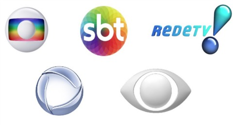

# TV Recognizer
Brazil Tv Station Logo Recognizer

This project was originally created to be part of Beep App project. The work uses Flutter framework to process a TensorFlow Lite model (FlatBuffer format) containing a Trained Convolutional Neural Network (CNN). The model processes a live video from Smartphone Camera (Using Camera plugin 0.5.3) on FLUTTER in order to recognize Tv Station Logos.

My ARTICLE on Medium about this logo detection:
[MEDIUM ARTICLE LINK](https://medium.com/@leonardo.ti.bruno/tv-stations-logo-recognition-20812f68e20a)

Goal:
----------
This basically recognize 6 main Brazil Tv Stations Logos (SBT, Globo, Record, RedeTV, Band, TvBrasil) on Android Smartphone and PC Webcam.

Data:
--------
- TFLITE file (TensorFlow Lite) on /assets folder, was constructed using:
  - Darknet: Open source neural network framework (C and CUDA), for GPU Computation [LINK](https://github.com/pjreddie/darknet)
  - YOLO V2 Tiny: Real-time object detection system, V2 Tiny version due the compatibility with TensorFlow Lite.
  - Fastai: vision library to manipulate, augment and also check the results of training.
  - Darkflow: To convert to Tflite PB (Protobuf) containing the model' weights and the graph definition.
  
- The Notebook [Logo_Data_Augmentation](https://colab.research.google.com/github/leoitcode/tv-recognizer/blob/master/Logo_Data_Augmentation.ipynb) was created on Google Colaboratory and show the whole code and explain the Data Augmentation Process.

- The Flutter Folders (TvLogo_Detect) consists of the Distance detection (for entire Television), and Close detection (for just logo on entire phone screen).

- Pre-made APKs to put directly into smartphone.

Setting Up:
-----------------------------------

First you will need to install Flutter for your platform:
https://flutter.dev/docs/get-started/install

Then run `flutter doctor` and be sure that no issues are reported for the sections relevant to your platform.

In order to run this ANDROID APP on a smartphone just do `flutter run` in the TVLogo Far or TVLogo Close directory.

Install from pre-made APK:
-----------------
You can install the apk directly on Smartphone:

- APK for Far distance: [LINK](logo_detect_far.apk)
- APK for Close distance: [LINK](logo_detect_close.apk)

PREVIEW:
-----------------
## Detection on Webcam:
 

## Detection on Smartphone:

## Detecion on Entire Screen:

Copyright © 2019 leoitcode
